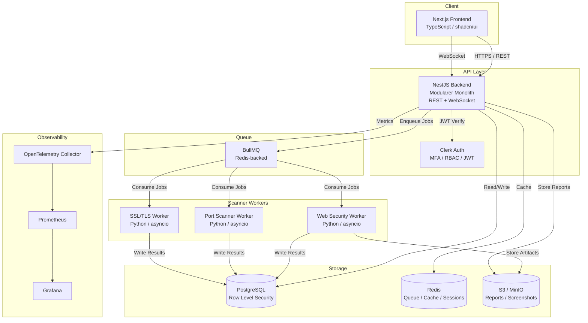

# IT-Architekt – Systemarchitektur PTaaS Platform

**Datum:** 2026-05-15  
**Rolle:** IT-Architekt  
**Phase:** Phase 1 MVP

---

## 1. Systemübersicht

Die PTaaS Platform ist ein **modularer Monolith** (NestJS) mit isolierten Python Scanner-Workern und einem Next.js Frontend. Die Scanner-Worker laufen als ephemere Kubernetes Jobs — sie werden bei Bedarf gestartet und nach Abschluss des Scans wieder vernichtet.

---

## 2. Architekturdiagramm (Mermaid)



---

## 3. Systemkomponenten

### 3.1 Frontend (Next.js)

| Aspekt | Entscheidung |
|--------|-------------|
| Framework | Next.js 14+ (App Router) |
| Sprache | TypeScript |
| UI Library | shadcn/ui + TailwindCSS |
| State | Zustand (global) + React Query (server state) |
| WebSocket | native WebSocket oder Socket.io-client |
| Auth | Clerk Next.js SDK |
| Charts | Recharts oder Tremor |

**Hauptseiten Phase 1:**
- `/login` `/register` — Auth
- `/dashboard` — Übersicht, Scan-Status, KPIs
- `/projects` — Projektverwaltung
- `/projects/[id]/scans` — Scan-Liste und Start
- `/projects/[id]/findings` — Findings-Liste mit Filter/Sort
- `/projects/[id]/reports` — Report-Download
- `/settings` — Team, API Keys, Profil

---

### 3.2 Backend (NestJS Modularer Monolith)

**Module-Struktur:**

```
src/
├── auth/           → JWT Guards, RBAC Decorators, Clerk Integration
├── tenants/        → Tenant Middleware, Tenant Context
├── users/          → User CRUD, Rollen
├── projects/       → Projekt CRUD, Asset Management
├── scans/          → Scan Queue, Job Management, WebSocket Events
├── findings/       → Finding CRUD, Severity, CVSS, Status
├── reports/        → PDF/JSON Generation, S3 Upload
├── audit/          → Audit Log Events
└── common/         → Guards, Interceptors, Filters, DTOs
```

**Schnittstellen:**
- REST API (versioned: `/api/v1/...`)
- WebSocket (Scan-Status Real-time Events)
- Webhook Receiver (Phase 2)

---

### 3.3 Scanner Engine (Python Microservices)

**Worker-Typen Phase 1:**

| Worker | Checks | Tools/Libs |
|--------|--------|-----------|
| Web Security Worker | Headers, CSP, CORS, Cookies, XSS Basics | `httpx`, `beautifulsoup4` |
| SSL/TLS Worker | Zertifikat, Protokoll, Cipher Suites | `ssl`, `cryptography`, `testssl.sh` |
| Port Scanner Worker | Open Ports, Service Detection | `python-nmap` |

**Worker-Lifecycle:**
1. BullMQ Job wird von NestJS enqueued
2. Kubernetes Job Controller startet Python Worker Pod
3. Worker holt Job-Payload via API (oder direkt aus Queue)
4. Worker führt Scan durch (Timeout: 5 Minuten max)
5. Worker schreibt Findings via API in PostgreSQL
6. Pod wird beendet, Kubernetes Job cleaned up

---

### 3.4 Datenbankschema (Phase 1, vereinfacht)

```sql
-- Tenants
tenants (id, name, plan, created_at)

-- Users
users (id, tenant_id, email, clerk_id, role, created_at)

-- Projects
projects (id, tenant_id, name, targets[], description, created_at)

-- Scans
scans (id, project_id, tenant_id, status, type, config, 
       started_at, completed_at, error)

-- Findings
findings (id, scan_id, project_id, tenant_id,
          title, description, severity, cvss_score,
          cve_id, cwe_id, owasp_category,
          affected_url, affected_component,
          proof_of_concept, remediation,
          status, false_positive,
          created_at, updated_at)

-- Reports
reports (id, project_id, tenant_id, scan_id,
         format, file_url, created_at)

-- Audit Logs
audit_logs (id, tenant_id, user_id, action, resource, 
            resource_id, metadata, ip_address, created_at)
```

**Row Level Security (RLS) Beispiel:**
```sql
ALTER TABLE findings ENABLE ROW LEVEL SECURITY;
CREATE POLICY tenant_isolation ON findings
  USING (tenant_id = current_setting('app.tenant_id')::uuid);
```

---

## 4. API-Design

**Basis-URL:** `https://api.ptaas.io/api/v1`

### Kern-Endpunkte Phase 1

```
POST   /auth/refresh
GET    /users/me
PATCH  /users/me

GET    /projects
POST   /projects
GET    /projects/:id
PATCH  /projects/:id
DELETE /projects/:id

POST   /projects/:id/scans
GET    /projects/:id/scans
GET    /projects/:id/scans/:scanId
DELETE /projects/:id/scans/:scanId

GET    /projects/:id/findings
GET    /projects/:id/findings/:findingId
PATCH  /projects/:id/findings/:findingId  (status, false_positive)

POST   /projects/:id/reports
GET    /projects/:id/reports
GET    /projects/:id/reports/:reportId/download

GET    /audit-logs
```

**Response Format (standardisiert):**
```json
{
  "data": { ... },
  "meta": { "page": 1, "limit": 20, "total": 143 },
  "error": null
}
```

---

## 5. Datenfluss – Scan-Lifecycle

```
User → POST /scans
     → NestJS: Validierung, Tenant-Check, Scan-Record anlegen
     → BullMQ: Job enqueued { scanId, targets, type, tenantId }
     → WebSocket: Event "scan:queued" → Frontend zeigt Warteschlange
     
Kubernetes Job Controller
     → Sieht neuen BullMQ Job
     → Startet Python Worker Pod (ephemer)
     
Python Worker
     → Führt Checks durch (bis 5 Min Timeout)
     → POST /api/internal/findings (Auth: Service API Key)
     → WebSocket: Event "finding:created" → Frontend zeigt Live-Finding
     → Job als "completed" markieren
     
NestJS
     → Scan-Status → "completed"
     → WebSocket: Event "scan:completed"
     → Audit Log schreiben
```

---

## 6. Skalierbarkeit & Performance

| Aspekt | Phase 1 | Phase 2+ |
|--------|---------|----------|
| Scanner Parallelität | 3–5 gleichzeitige Worker | 10–50+ via K8s HPA |
| DB Connections | PgBouncer Connection Pool | Read Replicas |
| API Rate Limiting | Redis-based, pro Tenant | Granularer per Endpoint |
| Frontend | Vercel CDN | Multi-Region |
| Queue | BullMQ / Redis | Kafka wenn nötig |
| Caching | Redis Query Cache | Distributed Cache |

---

## 7. Technologie-Entscheidungen (Begründungen)

| Technologie | Gewählt | Begründung |
|-------------|---------|-----------|
| ORM | Prisma | Type-safe, Migrations, gute PG-Integration |
| Queue | BullMQ | Redis-basiert, in NestJS gut integriert, UI via Bull Board |
| Auth | Clerk | MFA out-of-box, Next.js Integration, kein Security-Risiko durch Eigenentwicklung |
| PDF Reports | Puppeteer | Headless Chrome, HTML→PDF, gute Kontrolle über Layout |
| File Storage | S3-compatible (MinIO local, AWS S3 prod) | Standard, kosteneffizient |
| WebSocket | Socket.io (NestJS Adapter) | Robustes Fallback, Room-Support für Tenants |
| Validation | class-validator + class-transformer | NestJS-Standard, DTO-basiert |

---

## 8. Deployment-Architektur (Phase 1)

```
Entwicklung:
  docker-compose up
    → nest-api     (localhost:3001)
    → next-frontend (localhost:3000)
    → postgres     (localhost:5432)
    → redis        (localhost:6379)

Staging / Production (Kubernetes):
  Namespace: ptaas-prod
    → Deployment: api (2 Replicas)
    → Deployment: frontend (Vercel oder 2 Replicas)
    → CronJob/Controller: Scanner Worker Manager
    → Service: api (ClusterIP + Ingress)
    → PersistentVolume: (keines — zustandslos)
    → Secrets: Database URL, Redis URL, Clerk Keys, AWS Keys
```

---

## 9. Offene Architektur-Entscheidungen (Phase 2)

| Thema | Optionen | Empfehlung |
|-------|---------|-----------|
| GraphQL | REST beibehalten oder GraphQL hinzufügen | REST für Phase 2, GraphQL nur wenn Frontend-Anforderungen es fordern |
| Vector DB | pgvector vs. Qdrant | pgvector Extension — spart separaten Service |
| Service Mesh | Istio vs. Linkerd | Linkerd (einfacher) — erst ab Phase 3 relevant |
| Multi-Region | AWS Multi-Region | Erst ab Phase 4 Enterprise |
